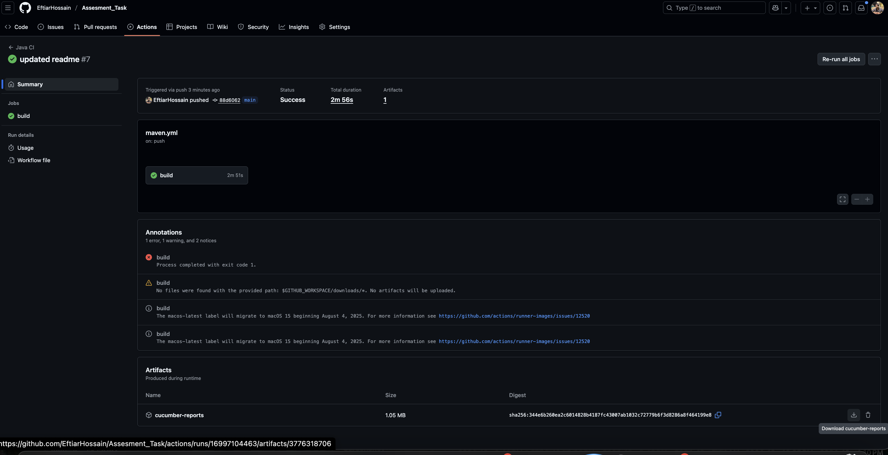

Overview

This project is an automation framework using Cucumber for behavior-driven testing and Selenium WebDriver for browser automation. It is designed to be scalable, maintainable, and readable, supporting cross-functional collaboration and automated regression testing.

ASSESSMENT_TASK/
├── .github/workflows/
│   └── maven.yml         # GitHub Actions workflow
├── src/
│   └── test/
│       ├── java/
│       │   ├── objectRepository/
│       │   │   └── FlightSearchPageOR.java   # Page Object Model classes
│       │   ├── runners/
│       │   │   └── TestRunner.java           # Cucumber test runner
│       │   ├── stepdefinitions/
│       │   │   ├── FlightSearchSteps.java    # Step definitions
│       │   │   └── Hooks.java                # Before/After hooks
│       │   └── utils/
│       │       ├── Base.java                 # Base WebDriver setup
│       │       ├── FileHelper.java           # File handling utilities
│       │       ├── Operations.java           # Common operations (click, type, etc.)
│       │       └── SoftAssertCollector.java  # Soft assertion handler
│       └── resources/
│           └── features/
│               └── Flight_Search.feature     # Cucumber feature files
├── target/                                   # Compiled files and reports
├── pom.xml                                   # Maven configuration
└── README.md

Features

      Cucumber Feature Files: Located in src/test/resources/features/

      Step Definitions: Located in src/test/java/stepdefinitions/

      Runners: Located in src/test/java/runners/

      Utilities: Helper classes for reusable operations and assertions

      CI/CD Integration: GitHub Actions workflow (maven.yml) supports manual runs and scheduled execution

How to Run Tests

1. Prerequisites

      JDK 11+

      Maven 3.6+

      Chrome or Firefox browser

      IDE (e.g., IntelliJ IDEA)

2. Run All Tests
      
      mvn clean test

3. Run Specific Feature File

      mvn test -Dcucumber.options="src/test/resources/features/Flight_Search.feature"

4. Run Tests via GitHub Actions

Trigger workflow manually from Actions → Workflows → Maven.yml → Run workflow.

The workflow executes tests and generates reports automatically.

Design Choices & Reasoning
1. Cucumber (BDD)

   Reasoning: Enables writing tests in plain English using Gherkin syntax. Facilitates collaboration between QA, developers, and non-technical stakeholders.

   Benefit: Ensures test cases align with business requirements.

2. Page Object Model (POM)

   Reasoning: Separates UI locators and page actions from test logic.

   Benefit: Improves maintainability and reduces code duplication. Changes in the UI require updates only in page classes.

3. Step Definitions

   Reasoning: Keeps reusable test logic separate from feature files.

   Benefit: Supports modularity and reduces redundancy across scenarios.

4. Utility Classes

   Reasoning: Common operations (click, input, waits) and assertion logic are centralized.

   Benefit: Simplifies test scripts, enhances reusability, and ensures consistent behavior across tests.

5. Hooks

   Reasoning: Handles setup (Before) and teardown (After) tasks automatically.

   Benefit: Guarantees proper test environment initialization and cleanup, improving test reliability.

6. Maven Project Structure

   Reasoning: Standardized Java project layout.

   Benefit: Simplifies dependency management, CI/CD integration, and IDE support.

7. CI/CD Integration

   Reasoning: GitHub Actions workflow triggers test execution automatically.

   Benefit: Provides continuous feedback, detects regression issues early, and maintains code quality.

This project is configured with GitHub Actions to run automated tests. You can trigger the workflow manually using the workflow dispatch feature.

Steps to Trigger:

      Go to the GitHub repository.

      Click on the Actions tab.

      Select the workflow you want to run (e.g., Java CI).

      Click the Run workflow button on the right.

      Select the branch to run the workflow on (default is usually main).

      Click Run workflow to start the automated tests.

      The workflow will execute on the selected branch and run all configured test scenarios using the Cucumber-Selenium framework.

Notes

      Due to UI elements issue the code is failling because the UI's has not static element used, xpath are changing randomly
      
      Test data can be externalized in resources/testdata (optional enhancement).

      Reports are generated in target folder after each test run. You can also find the report on Github action run as a Zip file

      

      Soft assertions are handled by SoftAssertCollector for collecting multiple verification failures in a single test.

